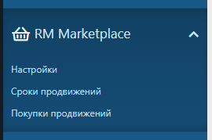
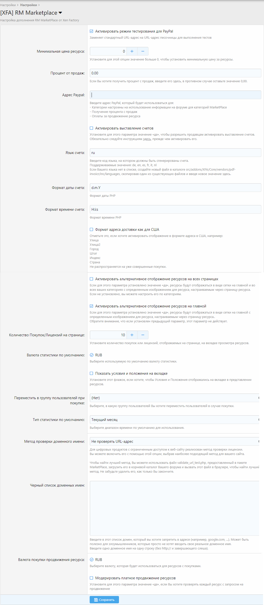

# Русификатор RM Marketplace
Русский язык плагина Xen Factory RM Marketplace для XenForo 2

## Файлы
### Скачать
* [XenForo](https://xenforo.com/)
* [Core](https://www.xen-factory.com/index.php?resources/core.90/)
* [XFA-RMMarketplace](https://www.xen-factory.com/index.php?resources/rm-marketplace-xf2.92/)

### Репозиторий
* [GitHub](https://github.com/ruXenForo/russian-XFA-RMMarketplace)

## Требования плагина
* XenForo 2.2 (Версия RM Marketplace 4.1.5+)
* XenForo Resource Manager 2.2 (Версия RM Marketplace 4.1.5+)
* Core > 1.5.8

## Совместимая версия
* XenForo 2.2.1
* XenForo Resource Manager 2.2
* RM Marketplace 4.3.4

## Описание плагина
RM Makertplace позволяет Вам и/или Вашим пользователям продавать ресурсы из XenForo Resource Manager (менеджера ресурсов), как на рынке! 

Поддерживает три типа продуктов:
* Цифровые продукты (на основе лицензии):
  * с или без продления лицензии
  * с или без лицензионных ограничений
  * с или без URL-адреса, обязательного для загрузки
* Физические продукты
* Предложения услуг

С помощью системы конфигурации «Категории ресурсов» администратор выбирает, какие категории предназначены для продажи ресурсов и типов продуктов, которые могут быть выставлены на продажу, из перечисленных здесь выше.

### Меню

### Настройки
