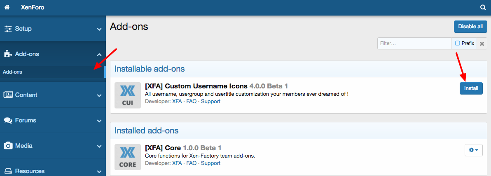
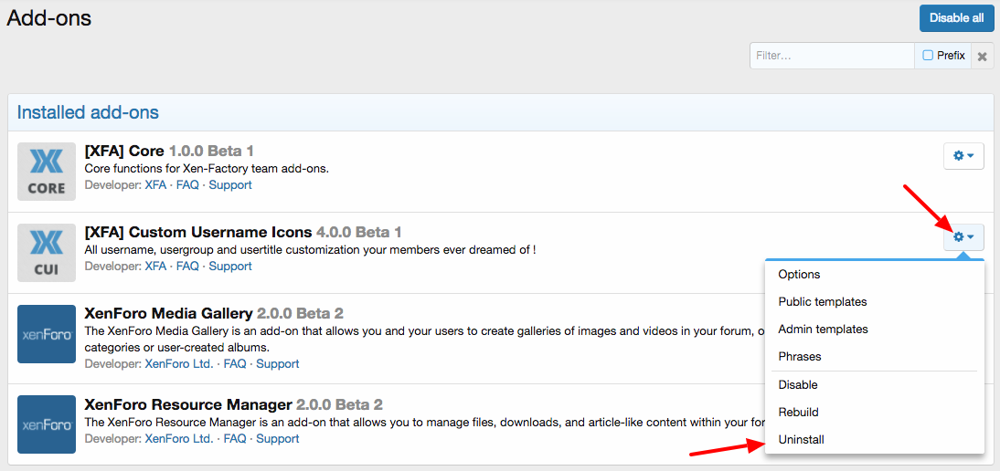

# Установка и удаление дополнения RM Marketplace

## Инструкции по установке

* Разархивируйте архив дополнения и загрузите содержимое папки загрузки из zip-архива продукта в каталог вашего форума. При загрузке обратите внимание на действия в случае конфликта файлов, т.е. выберите слияние для папок и перезапись для файлов.
* После загрузки файлов перейдите в свою панель администратора и кликните на ссылку «Список Дополнений» в меню «Дополнения» на левой боковой панели. Затем вам просто нужно нажать кнопку «Установить» в соответствующей строке списка устанавливаемых дополнений.
* После завершения процесса восстановления дополнение устанавливается.
* Обратите внимание, что для работы большинства наших надстроек необходимо установить надстройку Core (с помощью аналогичного процесса). Не забудьте сначала установить его.

## Инструкции по удалению

* Перейдите в свою панель администратора и кликните на ссылку «Список Дополнений» в меню «Дополнения» на левой боковой панели.
* На начальной странице нажмите на кнопку открытия меню справа от строки надстройки и нажмите на ссылку «Удалить» в меню.
* Что касается установки, она должна занять некоторое время, так как XenForo также восстанавливает файлы после удаления, просто подождите. После завершения процесса восстановления дополнение удаляется.
* Чтобы завершить процесс удаления, удалите папки и файлы с вашего сервера (посмотрите в zip-архиве надстройки список файлов, которые можно удалить).
* Некоторые надстройки могут использовать один и тот же файл.
* Если вы не уверены, следует ли вам удалять их или нет, обратитесь в нашу службу поддержки.

